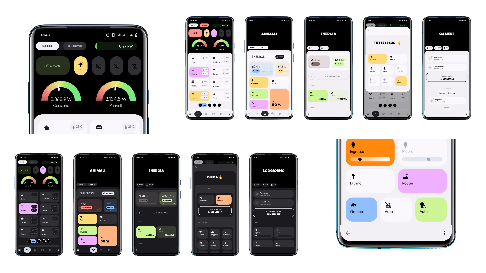
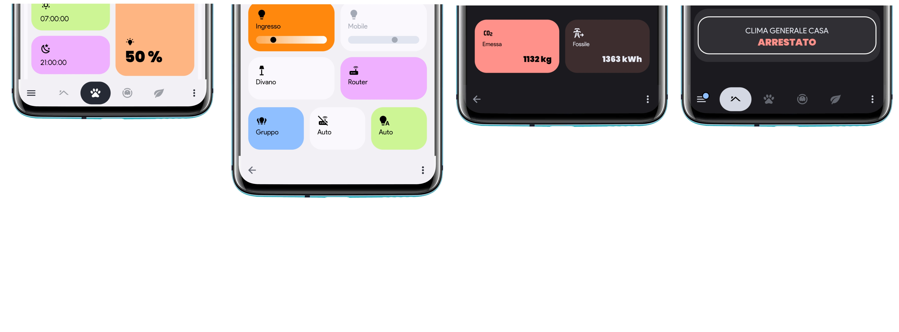
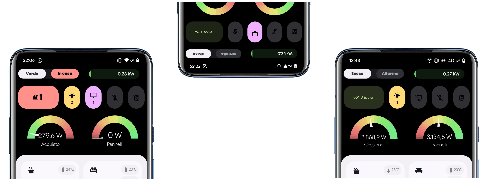
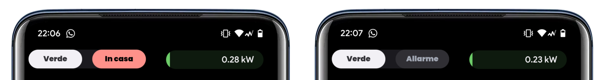
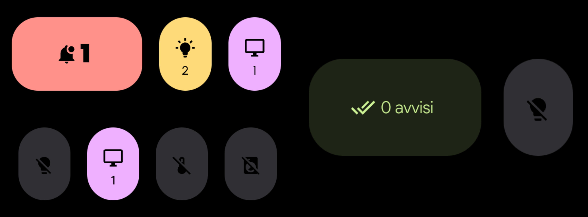
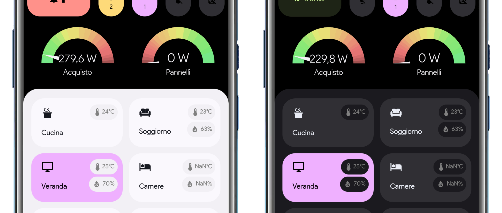
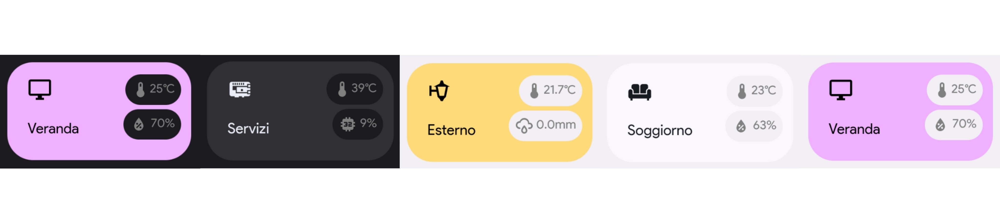
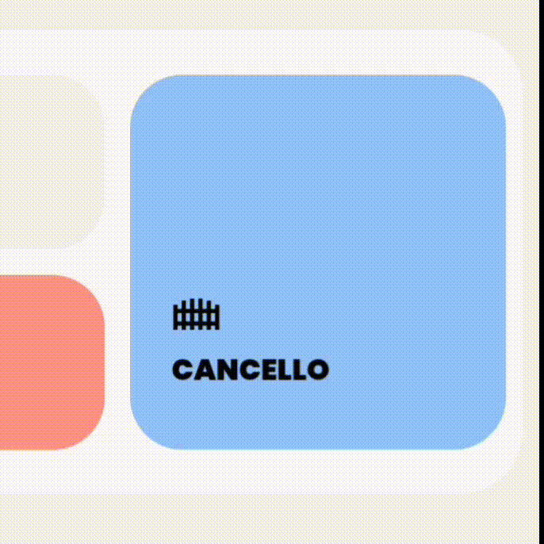

###### Pixel-like-dahsboard



### What's that?
This is an “Android 13 Pixel-like” dashboard based on [Rounded Dashboard by Leon](https://community.home-assistant.io/t/rounded-dashboard-guide/543043).
###### NB - I'm not a developer or anything, I'm a mere mortal who until recently was unknown to this whole world and is getting to know it from scratch.


## _________


# theme.yaml
It has to look like the pixel interface, so we need to use the exact **colors** and **fonts** first.



##### Add these codes to your theme:

<details><summary>colors</summary>
  As you can see here, the header always stays black while the panel varies light/dark, and as can be seen, the background of the notifications is brighter     than that of the panel, both in the dark and in the light mode.

  So, let's add these variables to the theme:
  ###### Assuming you already have the rounded theme
  ```
  ## White mode:
  white0: "#f2f0f4" #darker
  white00: "#fbf8fd" #brighter

  ## Dark mode:
  black0: "#1b1b1f" #darker
  black00: "#303034" #brighter
  ```
  So then we can add:
  ```
    modes:
      dark:
        contrast0: var(--black0)
        contrast00: var(--black00)
      light:
        contrast0: var(--white0)
        contrast00: var(--white00)
   ```
  
  In addition to this, to have a correct display of the colors and keep the **black amoled background** even in white mode, we have to set the theme colors in this way:
   ```
    # Main Interface Colors
    primary-color: var(--blue)
    accent-color: var(--blue)
    primary-background-color: var(--black1)
    secondary-background-color: var(--black0)
    divider-color: var(--black00)
    # Text
    primary-text-color: var(--white8)
    secondary-text-color: var(--white10)
    text-primary-color: var(--contrast20)
    disabled-text-color: var(--contrast6)
    text-accent-color: var(--contrast1)
    # Header:
    app-header-background-color: var(--black1) #STATUSBAR ANDROID
    app-header-text-color: var(--contrast12)
    app-header-selection-bar-color: transparent
    app-header-edit-background-color: var(--contrast0)
    app-header-edit-text-color: var(--contrast8)
    # Cards
    card-background-color: var(--black0)
    ha-card-background: var(--contrast00)
    ha-card-border-color: var(--contrast0)
    paper-listbox-background-color: var(--black00)
    # Tile card
    state-unavailable-color: var(--contrast6)
    state-light-off-color: var(--contrast10)
    state-light-on-color: var(--yellow)
    # Sidebar Menu
    sidebar-icon-color: var(--white8)
    sidebar-text-color: var(--white8)
    sidebar-background-color: var(--black0)
    sidebar-selected-icon-color: var(--blue)
    sidebar-selected-text-color: var(--white0)
   ```
  
  </details>
  
<details><summary>padding</summary>

 ```
  ha-card-border-radius: 25px
  grid-card-gap: 12px
  horizontal-stack-card-margin: 0px 8px
  vertical-stack-card-margin: 8px 8px
  ha-card-border-width: "0px" # Removes default 1px line
  
  ``` 
  
</details>

<details><summary>fonts</summary>
  
  ###### [How](https://community.home-assistant.io/t/trying-to-add-font/400236/2?u=arroma) to import a font.
  
  [Google Sans font](https://www.cdnfonts.com/google-sans.font) is used throughout the interface.
  
  [Poppins](https://fonts.google.com/share?selection.family=Poppins:wght@900) is used for titles and important values (optional).
 
  ```   
  card-mod-card-yaml: |
  .: |
    /* General changes */
    ha-card {
      transition: none !important;
      font-family: 'Product Sans' !important;
    }
  ``` 
  
  </details>

<details><summary>bottom bar</summary>

  ```
      error-color: "var(--google-red)"
      warning-color: "var(--google-yellow)"
      success-color: "var(--google-green)"
      info-color: "var(--google-blue)"
      header-height: "calc(var(--header-base-height) + env(safe-area-inset-bottom))"
      header-base-height: "60px"
      ha-dialog-border-radius: "25px"
      header-tab-indicator-color: "rgba(0, 0, 0, 0)"
      header-active-tab-color: "var(--contrast1)"
      header-active-tab-bg-color: "var(--contrast22)"
      header-all-tabs-color: "var(--contrast10)"
  
      card-mod-root-yaml: |
        ha-tabs$: |
          #tabsContent {
            width: 97%;
          }
        .: |
          .header {
            top: auto !important;
            bottom: 0; !important
            transform: translate3d(0px, 0px, 0px) !important;
            backdrop-filter: blur(50px);
            -webkit-backdrop-filter: blur(50px);
            -moz-backdrop-filter: blur(50px);
            -o-backdrop-filter: blur(50px);
            -ms-backdrop-filter: blur(50px);
            background-color: var(--contrast0) !important;
          }
          :host([scrolled]) .header {
            box-shadow: none !important;
          }
          .toolbar {
            height: var(--header-base-height) !important;
            padding-bottom: env(safe-area-inset-bottom) !important;
          }
          #view {
            margin-top: calc(-1 * var(--header-height)) !important;
            padding-bottom: var(--header-height);
          }
          ha-tabs {
            --paper-tabs-selection-bar-color: var(--header-tab-indicator-color);
            --mdc-icon-size: 26px;
            display: flex;
            justify-content: space-between;
            padding: 0 10px;
            height:50px !important;
          }
          paper-tab[aria-selected=true] {
            color: var(--contrast1);
            background-color: var(--contrast16);
          }
          paper-tab {
            color: var(--header-all-tabs-color);
            border-radius: 25px;
            height:50px;
            /*width: calc(100% / 4);
            padding: 0;*/
            padding-left: 20px;
            padding-right: 20px;
          }
          ha-menu-button, ha-button-menu {
            color: var(--contrast16);
          }
  ```
  
  </details>

## _________

### Let's start with the dashboard:

###### _These are examples of the main cards that I use in my dashboard, in the "cards" folder you will also find the codes of other cards._



# Pill
A good way to keep track of the garbage calendar, home alarm and current energy consumption



<details><summary>Pill code</summary>
    
  ```
    type: horizontal-stack
    cards:
      - type: custom:stack-in-card
        mode: horizontal
        keep:
          margin: true
          border_radius: true
          background: true
          outer_padding: false
        card_mod:
          style: |
            ha-card {
              background-color: var(--black0);
              border-radius: 25px;
              }
        cards:
          - type: custom:button-card
            name: '[[[return states["calendar.trash"].attributes.message]]]'
            show_label: false
            show_icon: false
            entity: calendar.trash
            tap_action:
              action: more-info
              haptic: light
            styles:
              card:
                - background: var(--black00)
                - font-weight: 500
                - line-height: 18px
                - border-radius: 24px
                - padding: 6px 10px
                - font-size: 12px
                - box-shadow: none
              name:
                - color: '#EAEDF6'
                - font-family: Poppins
              label:
                - color: '#777A83'
            state:
              - value: 'on'
                styles:
                  card:
                    - background: var(--white0)
                  name:
                    - color: var(--black00)
              - value: 'off'
                name: Nulla
                styles:
                  name:
                    - color: var(--white10)
                    - font-family: Product Sans
          - type: custom:button-card
            name: Alarm
            show_label: false
            show_icon: false
            entity: alarm_control_panel.alarm
            tap_action:
              action: more-info
              haptic: light
            styles:
              card:
                - background: var(--black00)
                - font-weight: 500
                - line-height: 18px
                - border-radius: 24px
                - padding: 6px 10px
                - font-size: 12px
                - box-shadow: none
              name:
                - color: var(--black0)
                - font-family: Poppins
            state:
              - value: disarmed
                styles:
                  card:
                    - background: var(--black00)
                  name:
                    - color: var(--white8)
              - value: armed_home
                name: At home
                styles:
                  card:
                    - background: var(--red)
                  name:
                    - color: var(--black)
                    - justify-self: center
              - value: armed_away
                name: Away
                styles:
                  card:
                    - background: var(--red)
                  name:
                    - color: var(--black)
              - value: armed_night
                name: Night
                styles:
                  card:
                    - background: var(--red)
                  name:
                    - color: var(--black)
              - value: armed_vacation
                name: Vacation
                styles:
                  card:
                    - background: var(--red)
                  name:
                    - color: var(--black)
              - value: armed_custom_bypass
                name: Bypass
                styles:
                  card:
                    - background: var(--red)
                  name:
                    - color: var(--black)
      - type: custom:bar-card
        card_mod:
          style: |
            ha-card {
              background: rgb(0,0,0,0);
              box-shadow: none;
              --primary-text-color: var(--white0);
              font-family: Product Sans ;
              }
            bar-card-name {
              margin-left: 0px;
            }
            bar-card-value {
              margin-right: 15px;
              font-family: Product Sans Medium ;
            }
            bar-card-card {
              margin-top: -15px;
              margin-left: 0px;
              margin-right: 0px;
              margin-bottom: 0px;
            }
        entities:
          - entity: sensor.energy_consumption
            name: ' '
            icon: none
            min: 0
            max: 7
            direction: right
            height: 30px
            positions:
              icon: inside
              name: 'off'
              value: inside
              indicator: 'off'
            unit_of_measurement: kW
            decimal: 2
            severity:
              - from: 0
                to: 0.2
                color: '#69cf78'
              - from: 0.2
                to: 0.5
                color: '#6ccc68'
              - from: 0.5
                to: 0.8
                color: '#77d169'
              - from: 0.8
                to: 1
                color: '#77c967'
              - from: 1
                to: 1.2
                color: '#8ccc66'
              - from: 1.2
                to: 1.5
                color: '#a5cf69'
              - from: 1.5
                to: 1.8
                color: '#b9bf60'
              - from: 1.8
                to: 2
                color: '#c7bf63'
              - from: 2
                to: 2.2
                color: '#c2ba61'
              - from: 2.2
                to: 2.5
                color: '#c9af65'
              - from: 2.5
                to: 2.8
                color: '#cca968'
              - from: 2.8
                to: 3
                color: '#cc9b66'
              - from: 3
                to: 3.2
                color: '#d18f6b'
              - from: 3.2
                to: 3.5
                color: '#de856f'
              - from: 3.5
                to: 3.8
                color: '#e88276'
              - from: 3.8
                to: 4
                color: '#e87676'
              - from: 4
                to: 4.2
                color: '#e67373'
              - from: 4.2
                to: 4.5
                color: '#d66b6b'
              - from: 4.5
                to: 5
                color: '#c26161'
              - from: 5
                to: 7
                color: '#a35252'
        tap_action:
          action: navigate
          navigation_path: /lovelace/energy
  ```
    
</details>

## _________

# Counter sensors
Very useful because it shows at a glance the entities that are on, clicking on it opens a popup showing all the entities of that category.

I made a bigger box for important alerts.



*Put everything under ```type:horizontal-stack```*

<details><summary>Alert box code</summary>

 Card taken from [here](https://community.home-assistant.io/t/rounded-dashboard-guide/543043/156?u)
  
  ```
    type: custom:button-card
    color_type: label-card
    layout: label
    show_name: false
    show_state: false
    show_units: false
    show_label: true
    show_icon: true
    entity: sensor.alerts_on
    icon: mdi:bell-badge
    label: '[[[ return states[''sensor.alerts_on''].state ]]]'
    hold_action:
      action: none
    styles:
      icon:
        - width: 20px
        - color: var(--black1)
      img_cell:
        - justify-content: flex-end
        - padding: 8px 5px
      grid:
        - grid-template-areas: '"i l"'
        - grid-template-columns: min-width min-width
        - height: 20px
      card:
        - background-color: var(--red)
        - border-radius: 25px
        - height: 70px
        - box-shadow: none
        - margin-top: '-10px'
        - margin-bottom: '-15px'
      label:
        - margin-left: 5%
        - justify-self: flex-start
        - color: var(--black1)
        - font-family: Poppins
        - font-size: 24px
    state:
      - value: '0'
        icon: mdi:check-all
        label: 0 avvisi
        styles:
          label:
            - font-size: 12px
            - color: var(--green)
            - font-family: Product Sans Light
          card:
            - background: var(--green-tint)
          icon:
            - color: var(--green)
            - width: 18px
    tap_action:
      haptic: light
      action: fire-dom-event
      browser_mod:
        service: browser_mod.popup
        data:
          title: ' '
          content:
  ```
  
</details>

<details><summary>Other boxes</summary>
  
  ```
    type: custom:button-card
    name: '[[[ return states[''sensor.lights_on''].state ]]]'
    icon: mdi:lightbulb-on
    entity: sensor.lights_on
    styles:
      grid:
        - grid-template-areas: '"i" "n" "slider"'
        - grid-template-columns: 1fr
        - grid-template-rows: 1fr min-content min-content
      card:
        - background: var(--yellow)
        - '--mdc-ripple-press-opacity': 0
        - border-radius: 25px
        - color: var(--contrast15)
        - height: 70px
        - width: 50px
        - box-shadow: none
        - margin-top: '-10px'
        - margin-bottom: '-15px'
      img_cell:
        - justify-self: center
        - width: 20px
        - margin: 10px 0px 0px 0px
      icon:
        - width: 20px
        - height: 20px
        - color: var(--black1)
      name:
        - justify-self: center
        - font-size: 12px
        - margin: 0px 0px 10px 0px
        - color: var(--black1)
        - font-family: Product Sans
    state:
      - value: '0'
        icon: mdi:lightbulb-off
        name: ' '
        styles:
          card:
            - background: var(--black00)
    tap_action:
    haptic: light
    action: fire-dom-event
    browser_mod:
      service: browser_mod.popup
      data:
        title: ' '
        content:
  ```
  
</details>

## _________

# Panel
Now we have to recreate the famous panel that Google has created since Android 12.

It can very well be done by playing with ```type: custom:stack-in-card```, the correct radius and the colors that we set at the beginning.




Let's start with the room card, I got the code from [here](https://community.home-assistant.io/t/rounded-dashboard-guide/543043/82?u) and made some slight changes to meet my needs.

Let's put them in a 2-column grid and place it under ```type: custom:stack-in-card```
<details><summary>Room card</summary>

  

  ```
      - type: custom:stack-in-card
        mode: vertical
        keep:
          margin: true
          border_radius: true
          background: true
          outer_padding: false
        card_mod:
          style: |
            ha-card {
              background-color: var(--contrast0);
              }
        cards:
          - square: false
            type: grid
            columns: 2
            cards:
              - type: custom:button-card
                entity: climate.mitsubishi
                icon: mdi:sofa
                name: Soggiorno
                tap_action:
                  action: navigate
                  navigation_path: /lovelace/soggiorno
                  haptic: light
                state:
                  - value: 'on'
                    styles:
                      card:
                        - background: rgba(var(--blue-rgb), 1)
                      icon:
                        - color: var(--black)
                      name:
                        - color: var(--black)
                    icon: mdi:fan
                  - value: dry
                    styles:
                      card:
                        - background: rgba(var(--blue-rgb), 1)
                      icon:
                        - color: var(--black)
                      name:
                        - color: var(--black)
                    icon: mdi:fan
                  - value: cool
                    styles:
                      card:
                        - background: rgba(var(--blue-rgb), 1)
                      icon:
                        - color: var(--black)
                      name:
                        - color: var(--black)
                    icon: mdi:snowflake
                  - value: heat
                    styles:
                      card:
                        - background: rgba(var(--orange-rgb), 1)
                      icon:
                        - color: var(--black)
                      name:
                        - color: var(--black)
                    icon: mdi:fire
                styles:
                  grid:
                    - grid-template-areas: '"i temp" "n hum"'
                    - grid-template-columns: 1fr 1fr
                    - grid-template-rows: 1fr min-content min-content
                  card:
                    - background: var(--contrast00)
                    - padding: 10px
                    - '--mdc-ripple-press-opacity': 0
                    - box-shadow: none
                    - height: 96px
                  img_cell:
                    - justify-self: start
                    - width: 24px
                    - margin: 10px
                  icon:
                    - width: 24px
                    - height: 24px
                    - color: var(--contrast18)
                  name:
                    - justify-self: start
                    - font-size: 14px
                    - margin: 10px
                    - color: var(--contrast18)
                    - font-family: Product Sans
                  custom_fields:
                    temp:
                      - align-self: start
                      - justify-self: end
                      - font-size: 12px
                      - font-weight: 500
                      - margin: 2px 0px 10px 0px
                      - color: grey
                      - font-family: Product Sans
                      - background-color: var(--contrast0)
                      - border-radius: 100px
                      - padding: 6px
                    hum:
                      - align-self: start
                      - justify-self: end
                      - font-size: 12px
                      - font-weight: 500
                      - margin: 2px 0px 10px 0px
                      - color: grey
                      - font-family: Product Sans
                      - background-color: var(--contrast0)
                      - border-radius: 100px
                      - padding: 6px
                custom_fields:
                  temp: |
                    [[[
                    return `<ha-icon
                      icon="mdi:thermometer"
                      style="width: 18px; height: 18px; color: grey;">
                      </ha-icon><span>${parseFloat(states['sensor.temp'].state).toFixed(0)}°C</span>`
                    ]]]
                  hum: |
                    [[[
                    return `<ha-icon
                      icon="mdi:water-percent"
                      style="width: 18px; height: 18px; color: grey;">
                      </ha-icon> <span>${parseFloat(states['sensor.hum'].state).toFixed(0)}%</span>`
                    ]]]
                card_mod:
                  style: |
                    ha-card:active {
                      box-shadow: none;
                      transform: scale(0.96);
                      transition: 200ms !important;
                      border-radius: 20px;
                      transform-origin: center;
                      }
  ```

</details>

Now let's place it under another ```type: custom: stack-in-card``` together with a gap-card.

The ```type: custom:gap-card``` will be placed both at the beginning and at the end of stack-in-card.
<details><summary>Code</summary>

  ```
    type: custom:stack-in-card
    mode: vertical
    keep:
      margin: true
      border_radius: true
      background: true
      outer_padding: false
    card_mod:
      style: |
        ha-card {
          background-color: var(--contrast0);
          border-radius: 30px;
          font-family: Product Sans ;
          }
    cards:
      - type: custom:gap-card
        height: 3
  
  ```
</details>

## _________

# Title and graph

In the titles I use ```font-family: Poppins``` because I like it, but you can use ```font-family: Product Sans Black``` to make it more pixel-like.


<details><summary>Title</summary>
  
  ```
    type: vertical-stack
    cards:
      - type: custom:button-card
        name: ENERGIA
        styles:
          card:
            - background: none
            - box-shadow: none
            - padding: 70px 0px 70px 0px
            - '--mdc-ripple-press-opacity': 0
          name:
            - font-size: 32px
            - color: var(--white0)
            - font-family: Poppins
      - type: custom:mushroom-chips-card
        chips:
          - type: entity
            entity: sensor.power_highest_peak_time_today
            double_tap_action:
              action: none
            icon: mdi:solar-power-variant
            content_info: state
            tap_action:
              action: more-info
            hold_action:
              action: none
        card_mod:
          style: |
            ha-card {
              --chip-background: var(--contrast0);
              --primary-text-color: var(--contrast18);
              font-family: Product Sans;
              }
        alignment: start
  ```
  _
 </details>
 
 <details><summary>Graph</summary>
  Here I'm using two stack-in-cards, note that I'm using two different background colors: var(--contrast0) and var(--contrast00), this is to give more tone to the graphs (see img).
  
  
  
  
  ```
  type: custom:stack-in-card
  mode: vertical
  keep:
    margin: true
    border_radius: true
    background: true
    outer_padding: false
  card_mod:
    style: |
      ha-card {
        background-color: var(--contrast0);
        border-radius: 30px;
        --primary-text-color: var(--contrast18);
        font-family: Product Sans ;
        }
  cards:
    - type: custom:gap-card
      height: 5
    - type: custom:stack-in-card
      mode: vertical
      keep:
        margin: true
        border_radius: true
        background: true
        outer_padding: false
      card_mod:
        style: |
          ha-card {
            background-color: var(--contrast00);
            border-radius: 30px;
            }
      cards:
        - type: custom:gap-card
          height: 5
        - type: custom:swipe-card
          card_mod:
            style: |
              ha-card {
                border-radius: 25px !important;
              }
          card_width: calc(100% - 48px)
          parameters:
            centeredSlides: false
            slidesPerView: 1.8
            spaceBetween: 16
            initialSlide: 0
          cards:
            - type: sensor
              entity: sensor.consumo_energia
              hours_to_show: 24
              detail: 1
              graph: line
              name: Consumo
              icon: none
              theme: sensor_color_brown
              card_mod:
                class: graph
                style: |
                  ha-card {
                    box-shadow: none;
                    }
                  .graph {
                    background: var(--brown-tint);
                  }
                      .graph .name {
                        background: var(--brown);
                        color: var(--black);
                      }
            - type: sensor
              entity: sensor.2_fotovoltaico_channel_1_power
              hours_to_show: 24
              detail: 1
              graph: line
              name: Produzione
              icon: none
              theme: sensor_color_green
              card_mod:
                class: graph
                style: |
                  ha-card {
                    box-shadow: none;
                    }
                  .graph {
                    background: var(--green-tint);
                  }
                      .graph .name {
                        background: var(--green);
                        color: var(--black);
                      }
  ```

  </details>


<details><summary>Graph color theme</summary>

  ```
    sensor_color_yellow:
    accent-color: "#ffda78"
  ```
  
  This theme must be placed in the theme folder ```/config/themes/sensor_color_yellow.yaml```
  ###### _You will find more in the theme folder._

</details>

## _________

# Something else -  animations!

A very simple animation when the car gate opens, it can be used with any entity, such as a light that turns on/off or any state change of any desired entity




<details><summary>On/off animation code</summary>

  ```

          - type: custom:button-card
            card_mod:
              style: |
                ha-card {
                  transition: 300ms !important;
                }
            name: CANCELLO
            icon: mdi:gate
            entity: switch.cancello
            tap_action:
              action: toggle
              haptic: heavy
            hold_action:
              action: more-info
              haptic: light
            styles:
              grid:
                - grid-template-areas: '"i" "n" "slider"'
                - grid-template-columns: 1fr
                - grid-template-rows: 1fr min-content min-content
              card:
                - height: 180px
                - background: var(--contrast00)
                - padding: 16px
                - '--mdc-ripple-press-opacity': 0
                - padding: 100px 0px 16px 20px
                - font-family: Poppins
              img_cell:
                - justify-self: start
                - width: 24px
              icon:
                - width: 24px
                - height: 24px
                - color: var(--contrast8)
              name:
                - justify-self: start
                - font-size: 14px
                - margin: 4px 0 12px 0
                - color: var(--contrast8)
                - font-family: Product Sans
            state:
              - value: 'on'
                name: Aprendo..
                styles:
                  card:
                    - background: var(--yellow)
                    - border-radius: 10px
                  icon:
                    - color: var(--black)
                  name:
                    - color: var(--black)
                    - font-family: Poppins
              - value: 'off'
                styles:
                  icon:
                    - color: var(--black)
                  card:
                    - background: var(--blue)
                  name:
                    - color: var(--black)
                    - font-family: Poppins
 ```

</details>

## _________